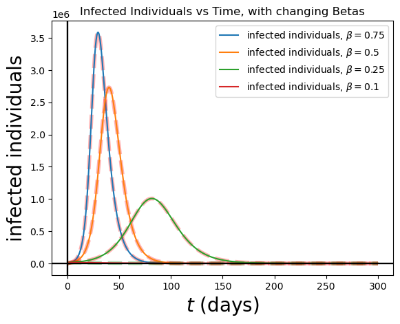
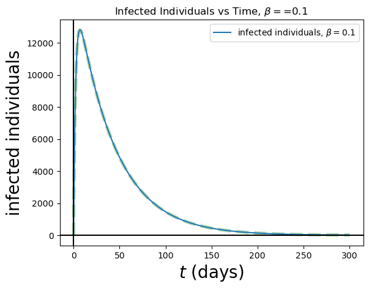
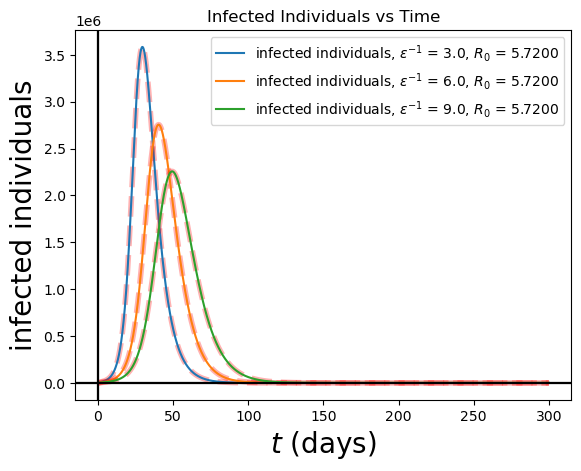
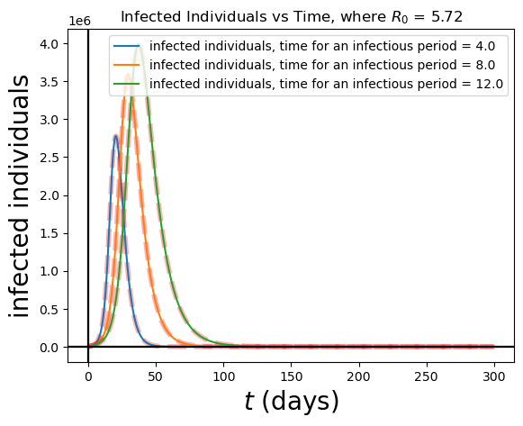
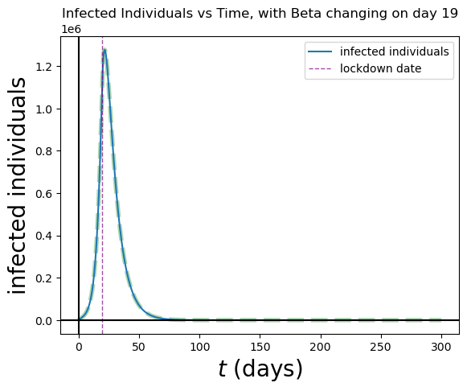
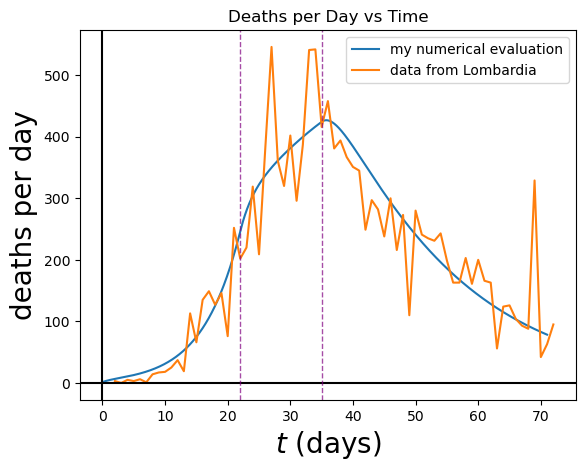

# Computational Project 2: SEIR model applied to study the Covid-19 epidemic in Lombardy

**_Author: A.J. Hoyt_**
**_Date: 2023-12-14_**

## Introduction
The covid-19 pandemic was a catastrophic event in recent history. The virus spread rapidly across the globe, and the world was not prepared. In this project, we will use a SEIR model to study the spread of the virus in the Lombardy region of Italy during the initial outbreak in early 2020. We will use the model to study the effects of different parameters on the spread of the virus. We will also use the model to study the effects of different measures taken to slow the spread of the virus. In this report, I will describe my theoretical model, discuss my code, present my numerical results, and discuss my main findings.


## Theoretical model

The SEIR model is a compartmental model that divides the population into four compartments: Susceptible, Exposed, Infected, and Recovered. The model is described by the following system of differential equations:

$$
\begin{align*}
\frac{dS}{dt}&=&\Lambda -\beta \frac{S(t)I(t)}{N(t)}-\mu S(t)\, , \\
\frac{dE}{dt}&=& \beta \frac{S(t)I(t)}{N(t)}-(\mu+\epsilon) E(t)\, , \\
\frac{dI}{dt}&=& \epsilon E(t) -(\gamma +\mu+\alpha) I(t)\, , \\
\frac{dR}{dt}&=& \gamma I(t)-\mu R(t)\, ,
\end{align*}
$$


where $S(t)$, $E(t)$, $I(t)$, and $R(t)$ are the number of susceptible, exposed, infected, and recovered individuals at time $t$, respectively. The parameter $\Lambda$ is the birth rate, $\mu$ is the death rate, $\beta$ is the infection rate, $\epsilon$ is the incubation rate, $\gamma$ is the recovery rate, and $\alpha$ is the death rate due to the disease. The total population is given by $N(t)=S(t)+E(t)+I(t)+R(t)$. The initial conditions are $S(0)=S_0$, $E(0)=E_0$, $I(0)=I_0$, and $R(0)=R_0$. The parameter values used in this project are given below.

additionally from these equations we can find the number of deaths and the death per day as a function of time:

$$

\begin{align*}
D(t) &=& N_0-N(t)\, , \\
\frac{dD}{dt}&=& -(\frac{dS}{dt}+\frac{dE}{dt}+\frac{dI}{dt}+\frac{dR}{dt})\, ,
\end{align*}
$$

where $D(t)$ is the number of deaths at time $t$.

| Parameters/ Initial Values | Value |
| --- | --- |
| $N_0$ | $10$ million |
| $E_0$ | $20000$ |
| $I_0$ | $1$ |
| $R_0$ | $0$ |
| $S_0$ | $N_0-E_0-I_0-R_0$ |
| $\alpha$ | $0.006$/day |
| $\beta$ | $0.75$/day |
| $\gamma$ | $(1/8)$/day |
| $\epsilon$ | $(1/3)$/day |
| $\mu$ | $1/(83*365)$/day |


To find the basic reproductive factor, we use the following formula:

$$
R_0 = \frac{\beta\epsilon}{(\mu+\epsilon)(\gamma+\mu+\alpha)} \approx 5.72
$$

With these initial values/parameters, we can solve the system of differential equations numerically using the Second Order Runga-Kutta method. The code is shown below.


```python
# Importing libraries
import numpy as np
import matplotlib.pyplot as plt

# Initial values
N_0 = 1e7 # initial population
ALPHA = 0.006 # 1/day virus induced death rate
BETA = 0.75 # 1/day Probability of disease transmission per contact (dimensionless) times the number of contacts per unit time
GAMMA = 0.125 # 1/day Recovery rate of infectious individuals (the reciprocal is the infectious period)
EPSILON = 1/3. # 1/day Rate of progression from exposed to infectious (the reciprocal is the incubation period)
MU = 1/(83.*365.) # 1/day, Per-capita natural death rate, we multiplied by 365 to get go from 1/year to 1/day

E_0 = 20000 # initial exposed
I_0 = 1 # initial infected
R_0 = 0 # initial recovered
S_0 = N_0 - E_0 - I_0 # initial susceptible

# solves differential equations
def f(r):
    xs=r[0]
    xe=r[1]
    xi=r[2]
    xr=r[3] 
    xn=xs+xe+xi+xr
    fs= - BETA * xs * xi / xn - MU * xs + MU * xn
    fe=   BETA * xs * xi / xn - ( MU + EPSILON ) * xe
    fi=   EPSILON * xe - ( GAMMA + MU + ALPHA ) * xi
    fr=   GAMMA * xi - MU*xr
    return np.array([fs,fe,fi,fr],float)

# Initial values
nstep = 10000
days = 300
t = np.linspace(0,days,nstep)
dt = t[1]-t[0]

# Initialize arrays to store
xs=np.zeros(nstep)
xe=np.zeros(nstep)
xi=np.zeros(nstep)
xr=np.zeros(nstep)

xfs =np.zeros(nstep)
xfe =np.zeros(nstep)
xfi =np.zeros(nstep)
xfr =np.zeros(nstep)

r = np.array([S_0,E_0,I_0,R_0],float)

# Second Order Runge-Kutta method
for i in range(nstep):
        xs[i]=r[0]
        xe[i]=r[1]
        xi[i]=r[2]
        xr[i]=r[3]
        k1=dt*f(r)
        k2=dt*f(r+0.5*k1)    
        r+=k2

        xf=f(r)
        xfs[i]=xf[0]
        xfe[i]=xf[1]
        xfi[i]=xf[2]
        xfr[i]=xf[3]
    
xdn = N_0  - ( xs + xe + xi + xr )
xd = - ( xfs + xfe + xfi + xfr )
```

## Part 2: Implementation of the SEIR model 

The SEIR model can be plotted as a function of time. The code below plots the number of susceptible, exposed, infected, and recovered individuals as a function of time.

``` python
# Plotting

plt.plot(t,xs,label="S")
plt.plot(t,xe,label="E")
plt.plot(t,xi,label="I")
plt.plot(t,xr,label="R")
plt.axhline(0, color='black')
plt.axvline(0, color='black')
plt.legend(loc="best")
plt.xlabel(r'$t$ (days)',fontsize=20) 
plt.ylabel(r'population',fontsize=20)
plt.title("SEIR Model for COVID-19 in Lombardy")
plt.show()

```

which gives the following plot:


The model indicates that the number of infected individuals reaches a maximum of $\approx 3585525$ during the $29^{th}$ day of the pandemic. Considering that around $5$% of the those who tested positive required ICU admission, this would have been a catastrophic event for the healthcare system in Lombardy. Given Italy's ben count of around $12.5$ beds per $100000$ people, and the fact that Lombardy has a population of around 10 million people, this would have meant that around 1250 ICU beds would have been available. This would have been far from enough to treat the number of patients that would have required ICU admission, as $5$% of the number of infected people surpasses the number of ICU beds on day 4 and comes below that on day 75. This would completely overwhelm the healthcare system.


We can also plot the total number of deaths and the number of deaths per day as a function of time. The code below plots the number of deaths and the number of deaths per day as a function of time.

``` python
# total deaths
plt.plot(t, xdn,label="number of dead individuals")
plt.axhline(0, color='black')
plt.axvline(0, color='black')
plt.legend(loc="best")
plt.xlabel(r'$t$ (days)',fontsize=20) 
plt.ylabel(r'dead individuals',fontsize=20)
plt.title("total deaths")
plt.show()

#total deaths per day
plt.plot(t, xd,label="deaths per day")
plt.axhline(0, color='black')
plt.axvline(0, color='black')
plt.legend(loc="best")
plt.xlabel(r'$t$ (days)',fontsize=20) 
plt.ylabel(r'deaths per day',fontsize=20)
plt.title("deaths per day")
plt.show()
```

which gives the following plots:


The model indicates that the number of deaths reaches $\approx 456883$. This is a catastrophic number of deaths, and it would have been a disaster for the region of Lombardy. The number of deaths per day reaches a maximum of $\approx 21513$ around the $29^{th}$ day. This is practically an unimaginable amount of death. 

## Part 3-6: Test of the model

### Part 3: changing $\beta$

because $\beta$ is related to the transmitability of a virus, we can change it to see how it affects the spread of the virus. Given how $\beta$ is in $R_0$'s numerator, we can expect that a lower $\beta$ will result in a lower $R_0$, and thus as $\beta$ decreases, $R_0$ will eventually drop below 1 significantly affecting the model, as this means that the virus is transmitted to less people than are infected with it.

The code below alters the initial function to accept different values of $\beta$ and plots the number of infected individuals as a function of time for different values of $\beta$.

``` python
def f(r,BETA):
    xs=r[0]
    xe=r[1]
    xi=r[2]
    xr=r[3] 
    xn=xs+xe+xi+xr
    fs= - BETA * xs * xi / xn - MU * xs + MU * xn
    fe=   BETA * xs * xi / xn - ( MU + EPSILON ) * xe
    fi=   EPSILON * xe - ( GAMMA + MU + ALPHA ) * xi
    fr=   GAMMA * xi - MU*xr
    return np.array([fs,fe,fi,fr],float)

BETAs = [0.75, 0.5, 0.25, 0.1]

for BETA in BETAs:
    N_0 = 1e7 # initial population
    ALPHA = 0.006 # 1/day virus induced death rate
    GAMMA = 0.125 # 1/day Recovery rate of infectious individuals (the reciprocal is the infectious period)
    EPSILON = 1/3. # 1/day Rate of progression from exposed to infectious (the reciprocal is the incubation period)
    MU = 1/(83.*365.) # 1/day, Per-capita natural death rate, we multiplied by 365 to get go from 1/year to 1/day

    E_0 = 20000 # initial exposed
    I_0 = 1 # initial infected
    R_0 = 0 # initial recovered
    S_0 = N_0 - E_0 - I_0 # initial susceptible
    R0 = (BETA*EPSILON)/((MU+EPSILON)*(GAMMA+MU+ALPHA))
    nstep = 10000
    days = 300
    t = np.linspace(0,days,nstep)
    dt = t[1]-t[0]

    xs=np.zeros(nstep)
    xe=np.zeros(nstep)
    xi=np.zeros(nstep)
    xr=np.zeros(nstep)

    xfs =np.zeros(nstep)
    xfe =np.zeros(nstep)
    xfi =np.zeros(nstep)
    xfr =np.zeros(nstep)

    r = np.array([S_0,E_0,I_0,R_0],float)

    for i in range(nstep):
            xs[i]=r[0]
            xe[i]=r[1]
            xi[i]=r[2]
            xr[i]=r[3]
            k1=dt*f(r,BETA)
            k2=dt*f(r+0.5*k1,BETA)    
            r+=k2

            xf=f(r,BETA)
            xfs[i]=xf[0]
            xfe[i]=xf[1]
            xfi[i]=xf[2]
            xfr[i]=xf[3]

    R0 = np.ones(nstep)*(BETA*EPSILON)/((MU+EPSILON)*(GAMMA+MU+ALPHA))
    plt.plot(t[np.logical_and(R0>1,R0<5.73)],xi[np.logical_and(R0>1,R0<5.73)],color="red",alpha = 0.3, linestyle = "dashed", linewidth=4)
    plt.plot(t[R0<1],xi[R0<1],color="green",alpha = 0.3, linestyle = "dashed", linewidth=4)
    plt.plot(t,xi,label=r"infected individuals, $\beta = $"+f'{BETA}')
    plt.axhline(0, color='black')
    plt.axvline(0, color='black')
    plt.legend(loc="best")
    plt.xlabel(r'$t$ (days)',fontsize=20)
    plt.ylabel(r'infected individuals',fontsize=20)
    plt.title("Infected Individuals vs Time, with changing Betas")
plt.show()
```
which yields the following plot:


> The dashed lines represent the basic reproductive factor, $R_0$. The red dashed line represents $R_0>1$, and the green dashed line represents $R_0<1$. The solid lines represent the number of infected individuals as a function of time for different values of $\beta$. 

As beta shrinks, $R_0$ shrinks as well. When $\beta$ decreases, the number of days it takes to reach the maximum increases, and the maximum itself decreases with beta. The print statements back this up.

Because of the significant difference in the shape of infected models with $R_0>1$ and $R_0<1$, it may be hard to notice, but the model where $\beta = 0.1$ has a much lower peak than the model where $\beta = 0.75$. It appears to practically be on the x axis itself. 

a zoomed in version of the plot is shown below and provides more accurate representation of the difference between the models and demonstrates how a low $\beta$ value causes an otherwise equal virus to subside much quicker with much smaller spread.:



This graph has a right skew, as opposed to the others which look like a normal distribution curve (i know these are not PDF curves, but the shapes are similar). The maximum is reached much quicker and is much lower than what we would expect had the pattern of the other graphs held. This is because the number of people infected by one person is less than one, so the number of infected people will drop to zero much faster because it is being spread to less people than are currently infected.

This goes to show that a virus with a low $R_0$ poses much less of a threat than an equal virus with a higher $R_0$, because it cannot spread as much. 

### Part 4: changing the initial condition for the Exposed individuals, $E(0)$

The question asks us to pick to values of $R_0$, with one satisfying $R_0>1$ and one satisfying $R_0<1$. We will use the values $R_0 = 5.72$ and $R_0 = 0.1$. We will then plot the number of infected individuals as a function of time for different values of $E(0)$, specifically $10K,100K,1M$ individuals.

I expect that of course where $R_0>1$, the peaks are much much higher than when $R_0<1$.

We recycled much of the same code from part 3, but we changed the initial values of $E_0$ and $I_0$ to be $10K,100K,1M$ individuals. We also changed the $R_0$ values to be $5.72$ and $0.1$, and added an outer for loop to cycle through those values. We also changed the plot title to reflect the $R_0$ value.

``` python
E_0s = [10000, 100000, 1000000]
R0s = [5.72, 0.1]

for R0 in R0s:
    for E_0 in E_0s:
        N_0 = 1e7 # initial population
        ALPHA = 0.006 # 1/day virus induced death rate
        BETA = R0*((MU+EPSILON)*(GAMMA+MU+ALPHA))/EPSILON # 1/day Probability of disease transmission per contact (dimensionless) times the number of contacts per unit time
        GAMMA = 0.125 # 1/day Recovery rate of infectious individuals (the reciprocal is the infectious period)
        EPSILON = 1/3. # 1/day Rate of progression from exposed to infectious (the reciprocal is the incubation period)
        MU = 1/(83.*365.) # 1/day, Per-capita natural death rate, we multiplied by 365 to get go from 1/year to 1/day

        E_0 = E_0 # initial exposed
        I_0 = 1 # initial infected
        R_0 = 0 # initial recovered
        S_0 = N_0 - E_0 - I_0 # initial susceptible
#        R0 = (BETA*EPSILON)/((MU+EPSILON)*(GAMMA+MU+ALPHA))
        nstep = 10000
        days = 300
        t = np.linspace(0,days,nstep)
        dt = t[1]-t[0]

        xs=np.zeros(nstep)
        xe=np.zeros(nstep)
        xi=np.zeros(nstep)
        xr=np.zeros(nstep)

        xfs =np.zeros(nstep)
        xfe =np.zeros(nstep)
        xfi =np.zeros(nstep)
        xfr =np.zeros(nstep)

        r = np.array([S_0,E_0,I_0,R_0],float)

        for i in range(nstep):
                xs[i]=r[0]
                xe[i]=r[1]
                xi[i]=r[2]
                xr[i]=r[3]
                k1=dt*f(r,BETA)
                k2=dt*f(r+0.5*k1,BETA)    
                r+=k2

                xf=f(r,BETA)
                xfs[i]=xf[0]
                xfe[i]=xf[1]
                xfi[i]=xf[2]
                xfr[i]=xf[3]
                
        
        R0 = np.ones(nstep)*(BETA*EPSILON)/((MU+EPSILON)*(GAMMA+MU+ALPHA))
        plt.plot(t[R0>1],xi[R0>1],color="red",alpha = 0.3, linestyle = "dashed", linewidth=4)
        plt.plot(t[R0<1],xi[R0<1],color="green",alpha = 0.3,linestyle = "dashed", linewidth=4)
        R0 = (BETA*EPSILON)/((MU+EPSILON)*(GAMMA+MU+ALPHA))
        plt.plot(t,xi,label=f'infected individuals, $R_0$ = {R0}')
        plt.axhline(0, color='black')
        plt.axvline(0, color='black')
        plt.legend(loc="best")
        plt.xlabel(r'$t$ (days)',fontsize=20)
        plt.ylabel(r'infected individuals',fontsize=20)
        plt.title("Infected Individuals vs Time, where R_0 = "+ f'{R0}')
    plt.show()
``` 

which yields the following plots:


As expected, the peaks are much higher where $R_0$>1 than where $R_0<1$. However, when comparing models starting with $E_0$ of $10$ k, $100$ k, and $1$ M when $R_0>1$ The peaks do not increase that much with each jump in $E_0$. However, they stay very high whereas changing $\beta$ caused quite a crash as $\beta$ decreased. when $R_0<1$, the peaks are much lower, but the peaks increase much more drastically (roughly by powers of 10) with each jump in $E_0$. Additionally, where $R_0>1$ the higher the $E_0$, the sooner the maximum is reached. This is not the case when $R_0<1$, as the maximum is reached on the same day (day 4) for all $E_0$ values. The maximums in this exercise are the same or much higher than the previous exercise where we changed $\beta$.   


### Part 5: changing the incubation period 

$\epsilon$ is the rate of progression from exposed to infectious. This means that a lower $\epsilon$ will result in a longer incubation period, which is the amount of days it takes for an individual to move from exposed to infectious (also represented as $\epsilon^{-1}$). This means that as epsilon increases, the virus will take longer to spread, as it will take people longer to become infectious/contagious, and thus the peak will be reached later.

The code below alters the initial function to accept different values of $\epsilon$ and plots the number of infected individuals as a function of time for different values of $\epsilon$.

``` python
R0S = [5.72, 0.1]
EPSILONS = [1/3., 1/6., 1/9.]

for R0 in R0S:
    for EPSILON in EPSILONS:
        N_0 = 1e7 # initial population
        BETA = R0*((MU+EPSILON)*(GAMMA+MU+ALPHA))/EPSILON # 1/day Probability of disease transmission per contact (dimensionless) times the number of contacts per unit time, beta changing to satisfy R0
        ALPHA = 0.006 # 1/day virus induced death rate
        GAMMA = 0.125 # 1/day Recovery rate of infectious individuals (the reciprocal is the infectious period)
        EPSILON = EPSILON # 1/day Rate of progression from exposed to infectious (the reciprocal is the incubation period)
        MU = 1/(83.*365.) # 1/day, Per-capita natural death rate, we multiplied by 365 to get go from 1/year to 1/day

        E_0 = 20000 # initial exposed
        I_0 = 1 # initial infected
        R_0 = 0 # initial recovered
        S_0 = N_0 - E_0 - I_0 # initial susceptible
        R0 = (BETA*EPSILON)/((MU+EPSILON)*(GAMMA+MU+ALPHA))
        nstep = 10000
        days = 300
        t = np.linspace(0,days,nstep)
        dt = t[1]-t[0]

    #...the classic empty arrays and runga-kutta 2nd order method...

    R0 = np.ones(nstep)*(BETA*EPSILON)/((MU+EPSILON)*(GAMMA+MU+ALPHA))
    plt.plot(t[R0>1],xi[R0>1],color="red",alpha = 0.3, linestyle = "dashed", linewidth=4)
    plt.plot(t[R0<1],xi[R0<1],color="green",alpha = 0.3,linestyle = "dashed", linewidth=4)
    R0 = (BETA*EPSILON)/((MU+EPSILON)*(GAMMA+MU+ALPHA))
    plt.plot(t,xi,label=f'infected individuals, $\epsilon^{{-1}}$ = {np.reciprocal(EPSILON)}, $R_0$ = {R0:.4f}')

    # plot infected individuals vs t where xR0<1
    plt.axhline(0, color='black')
    plt.axvline(0, color='black')
    plt.legend(loc="best")
    plt.xlabel(r'$t$ (days)',fontsize=20)
    plt.ylabel(r'infected individuals',fontsize=20)
    plt.title("Infected Individuals vs Time")
    plt.show()
```

which yields the following plots:




As expected, the higher the $\epsilon$, the later the maximum is reached. Additionally, the higher the $\epsilon$, the lower the maximum. This is because the higher the $\epsilon$, the longer it takes for people to become infectious, and thus the longer it takes for the virus to be able to spread. This means that the peak is reached later, and the peak is lower because the virus has less time to spread.

Where $R_0>1$, the models still have the normal curve look, where as where $R_0<1$, the models have that right skew. This is because where $R_0>1$, the virus is able to spread to more people than are currently infected, so the number of infected people increases. Where $R_0<1$, the virus is not able to spread to more people than are currently infected, so the number of infected people decreases. So it is kind of a double whammy with time here because it taks long to spread, and when it spreads it spreads to less people than are currently infected. For both tho, it takes longer to reach the maximum as $\epsilon$ increases, and the maximum decreases as $\epsilon$ increases.The time difference I would say that these changes based on different epsilon values are more pronounced for $R_0>1$ than for $R_0<1$. For example, when $R_0<1$, the maximums are reached within one week of each other for the different incubation periods, whereas the maximums are reached in at least over a week if not more for the different incubation periods when $R_0>1$.

### Part 6: changing the infectious period

$\gamma$ is the recovery rate of infectious individuals. This means that a lower $\gamma$ will result in a longer infectious period, which is the amount of days it takes for an individual to move from infectious to recovered (also represented as $\gamma^{-1}$). This means that as $\gamma$ decreases (or you could say as the infectious period $\gamma^{-1}$ increases), the virus will take longer to spread, as it will take people longer to recover, and thus the peak will be reached later. Because people are infectious for longer, the virus will be able to spread for longer, and thus the peak will be larger for longer infectious periods all else held constant.

The code below alters the initial function to accept different values of $\gamma$ and plots the number of infected individuals as a function of time for different values of $\gamma$.

``` python

ROs = [5.72,0.1]
GAMMAs = [1/4., 1/8., 1/12.]

for R0 in ROs:
    for GAMMA in GAMMAs:
        N_0 = 1e7 # initial population
        ALPHA = 0.006 # 1/day virus induced death rate
        GAMMA = GAMMA # 1/day Recovery rate of infectious individuals (the reciprocal is the infectious period)
        EPSILON = 1/3 # 1/day Rate of progression from exposed to infectious (the reciprocal is the incubation period)
        MU = 1/(83.*365.) # 1/day, Per-capita natural death rate, we multiplied by 365 to get go from 1/year to 1/day

        E_0 = 20000 # initial exposed
        I_0 = 1 # initial infected
        R_0 = 0 # initial recovered
        S_0 = N_0 - E_0 - I_0 # initial susceptible
        BETA = R0*((MU+EPSILON)*(GAMMA+MU+ALPHA))/EPSILON # beta changing to satisfy R0
        nstep = 10000
        days = 300
        t = np.linspace(0,days,nstep)
        dt = t[1]-t[0]
    
... # empty arrays and runga-kutta stuff

        R0 = np.ones(nstep)*(BETA*EPSILON)/((MU+EPSILON)*(GAMMA+MU+ALPHA))
        plt.plot(t[R0>1],xi[R0>1],color="red",alpha = 0.3, linestyle = "dashed", linewidth=4)
        plt.plot(t[R0<1],xi[R0<1],color="green",alpha = 0.3,linestyle = "dashed", linewidth=4)
        R0 = (BETA*EPSILON)/((MU+EPSILON)*(GAMMA+MU+ALPHA))
        plt.plot(t,xi,label=f'infected individuals, time for an infectious period = {np.reciprocal(GAMMA)}')
        # R0 = np.ones(nstep)*(BETA*EPSILON)/((MU+EPSILON)*(GAMMA+MU+ALPHA))
        # R0 = (BETA*EPSILON)/((MU+EPSILON)*(GAMMA+MU+ALPHA))
        # plot infected individuals vs t where xR0<1
        plt.axhline(0, color='black')
        plt.axvline(0, color='black')
        plt.legend(loc="best")
        plt.xlabel(r'$t$ (days)',fontsize=20)
        plt.ylabel(r'infected individuals',fontsize=20)
        plt.title("Infected Individuals vs Time, where $R_0$ = "+ f'{R0:.2f}')
    plt.show()
```

which yields the following plots:




As expected, the higher the $\gamma^{-1}$, the later the maximum is reached. Additionally, the higher the $\gamma^{-1}$, the higher the maximum. This is because the higher the $\gamma^{-1}$, the longer it takes for people to become recovered, and thus the longer it takes for the virus to be able to spread, and the more time infectious people have to spread it to more people.

Where $R_0>1$, the models still have the normal curve look, where as where $R_0<1$, the models have that right skew. This is because where $R_0>1$, the virus is able to spread to more people than are currently infected, so the number of infected people increases. For both tho, it takes longer to reach the maximum as $\gamma^{-1}$ increases, and the maximum increases as $\gamma^{-1}$ increases.

## Part 7: Modelling a lockdown

In theory, an isolation lockdown should reduce the oppurtunities of contact between people, thus lowering the change of exposure. By limiting the infected's oppurtunities to expose susceptible to the virus, we will curb the spread by lowering $R_0$. We can model a lockdown by changing $\beta$ to a lower value. at a certain point in time. We will change $\beta$ so that $R_0$ drops from $5.72$ to $0.1$, and thus the virus will subside.

The code below uses changes the runga-kutta loop slightly, so that at day 22 the desired value of $R_0$ changes (indicating an new lockdown in place), thus changing the value of $\beta$ to alter the differential equations. The code after plots the SEIR model. It also plots the number of deaths and the number of deaths per day as functions of time.

``` python
for i in range(nstep):
        R0 = np.where(t[i]<22,5.72,0.1)
        BETA = R0*((MU+EPSILON)*(GAMMA+MU+ALPHA))/EPSILON
        xs[i]=r[0]
        xe[i]=r[1]
        xi[i]=r[2]
        xr[i]=r[3]
        k1=dt*f(r,BETA)
        k2=dt*f(r+0.5*k1,BETA)    
        r+=k2

        xf=f(r,BETA)
        xfs[i]=xf[0]
        xfe[i]=xf[1]
        xfi[i]=xf[2]
        xfr[i]=xf[3]


xdn = N_0  - ( xs + xe + xi + xr )
xd = -(xfs + xfe + xfi + xfr)

#SEIR model
plt.plot(t,xs,label="S")
plt.plot(t,xe,label="E")
plt.plot(t,xi,label="I")
plt.plot(t,xr,label="R")
plt.axhline(0, color='black')
plt.axvline(0, color='black')
plt.axvline(22, color='purple', alpha = 0.7, linestyle='dashed', linewidth=1,label="lockdown date")
plt.legend(loc="best")
plt.xlabel(r'$t$ (days)',fontsize=20)
plt.ylabel(r'population',fontsize=20)
plt.title("SEIR Model for COVID-19 in Lombardy with Lockdown")
plt.show()

# just the infected individuals model
R0 = np.ones(nstep)*(BETA*EPSILON)/((MU+EPSILON)*(GAMMA+MU+ALPHA))
plt.plot(t[np.logical_and(R0>1,R0<5.73)],xi[np.logical_and(R0>1,R0<5.73)],color="red",alpha = 0.3, linestyle = "dashed", linewidth=4)
plt.plot(t[R0<1],xi[R0<1],color="green",alpha = 0.3, linestyle = "dashed", linewidth=4)
plt.plot(t,xi,label="infected individuals")
plt.axhline(0, color='black')
plt.axvline(0, color='black')
plt.axvline(22, color='purple', alpha = 0.7, linestyle='dashed', linewidth=1,label="lockdown date")
plt.legend(loc="best")
plt.xlabel(r'$t$ (days)',fontsize=20)
plt.ylabel(r'infected individuals',fontsize=20)
plt.title("Infected Individuals vs Time, with Beta changing on day 22")
plt.show()

#total deaths 
plt.plot(t,xdn,label="number of dead individuals")
plt.axhline(0, color='black')
plt.axvline(0, color='black')
plt.axvline(22, color='purple', alpha = 0.7, linestyle='dashed', linewidth=1,label="lockdown date")
plt.legend(loc="best")
plt.xlabel(r'$t$ (days)',fontsize=20)
plt.ylabel(r'dead individuals',fontsize=20)
plt.title("total deaths")
plt.show()

#total deaths per day
plt.plot(t, xd, label="deaths per day")
plt.axhline(0, color='black')
plt.axvline(0, color='black')plt.axvline(22, color='purple', alpha = 0.7, linestyle='dashed', linewidth=1,label="lockdown date")
plt.legend(loc="best")
plt.xlabel(r'$t$ (days)',fontsize=20)
plt.ylabel(r'deaths per day',fontsize=20)
plt.title("deaths per day")
plt.show()
``` 
the plots yield the following:


Most noteably on the graph of the full SEIR model, but also apparent on all of the graphs in my opinion, is that the lockdown seems to have an immediate impact on the contagiousness of the virus. The number of susceptible indivudals stabilizes immediately and the number of exposed and infected individuals drops nearly immediately.

The last statement is apparent in the separate graph of the number of infected individuals, where the number of infected individuals drops steeply almost immediately. This is because the number of people infected by one person is less than one, so the number of infected people will drop to zero much faster because it is being spread to less people than are currently infected.

This is what we expected by implementing a lockdown, and it is good to see that the model reflects this. This happened because we changed $\beta$ to a lower value so that we could lower $R_0$ to a value below 1, thus causing the virus to subside by forcing  people inside their homes to protect susceptible people from exposure and prevent  the infected from infecting the susceptible. Thus, we eliminated many oppurtunities for the virus to spread so that it could not spread to more people than are currently infected.

because of the lockdown. our total death was $\approx 225000$ people. This is a lot of people, but it is much better than the $\approx 456900$ people that would have died had we not implemented a lockdown. This is a difference of $\approx 231900$ people. This is a huge difference, and it shows the importance of implementing a lockdown to prevent the spread of a virus.

the process is repeated a second time, but with a lockdown date 3 days earlier represented by the change of the line:
    
``` python
R0 = np.where(t[i]<22,5.72,0.1)
```
to 
``` python
 R0 = np.where(t[i]<19,5.72,0.1)
 ```

which yields the following plots:





Here, we can clearly see our theory that a lockdown implemented just days soone can minimize the spread by a lot. We experience the same immediate and near immediate changes in the model on the day of the lockdown. However, because we caught it earlier, we were able to only lose $\approx 130500$ people, whereas if we waited $3$ days we would lose $\approx 225000$ people. This is very significant, because just $3$ days saved $\approx 94500$ lives.

This shows the importance of acting quick on policies that can reduce transmission rates, and shows how delays can have grave consequences.

## Part 8: Comparing to real data.

While our model predicts how effective a lockdown could be in a deadly pandemic, we can compare our model to real data to see how accurate our model is. We will compare our model to the real data from Lombardy, Italy. We will compare the number of infected individuals as a function of time, the number of deaths as a function of time, and the number of deaths per day as a function of time.

I used the code below to load the data from Lombardia in. 
    
``` python
# load data from dataLombardia.csv
data = np.loadtxt("dataLombardia.csv",delimiter=",",skiprows=1)
days = data[:,0]
total_deaths = data[:,1]
deaths_per_day = data[:,2]
```

```python
# numerical solution


ALPHA = 0.00144
BETA1 = 0.75
BETA2 = 0.34
BETA3 = 0.2
GAMMA = 1/4.02
MU = 1/(83.*365.)
EPSILON = 1/4.25

N_0 = 1e7 # initial population

E_0 = 11460 # initial exposed
I_0 = 1000 # initial infected
R_0 = 0 # initial recovered

S_0 = N_0 - E_0 - I_0 # initial susceptible

def f(r,BETA):
    xs=r[0]
    xe=r[1]
    xi=r[2]
    xr=r[3] 
    xn=xs+xe+xi+xr
    fs= - BETA * xs * xi / xn - MU * xs + MU * xn
    fe=   BETA * xs * xi / xn - ( MU + EPSILON ) * xe
    fi=   EPSILON * xe - ( GAMMA + MU + ALPHA ) * xi
    fr=   GAMMA * xi - MU*xr
    return np.array([fs,fe,fi,fr],float)

nstep = 100000
t = np.linspace(0,len(days),nstep)
dt = t[1]-t[0]

xs=np.zeros(nstep)
xe=np.zeros(nstep)
xi=np.zeros(nstep)
xr=np.zeros(nstep)

xfs =np.zeros(nstep)
xfe =np.zeros(nstep)
xfi =np.zeros(nstep)
xfr =np.zeros(nstep)

r = np.array([S_0,E_0,I_0,R_0],float)

for i in range(nstep):
        BETA = np.where(t[i]<22,BETA1,np.where(t[i]<35,BETA2,BETA3))
        xs[i]=r[0]
        xe[i]=r[1]
        xi[i]=r[2]
        xr[i]=r[3]
        k1=dt*f(r,BETA)
        k2=dt*f(r+0.5*k1,BETA)    
        r+=k2

        xf=f(r,BETA)
        xfs[i]=xf[0]
        xfe[i]=xf[1]
        xfi[i]=xf[2]
        xfr[i]=xf[3]

xdn = N_0  - ( xs + xe + xi + xr )
xd = - ( xfs + xfe + xfi + xfr )


# total deaths
plt.plot(t,xdn,label="my numerical evaluation")
plt.plot(days,total_deaths,label="data from Lombardia")
plt.legend(loc="best")
plt.xlabel(r'$t$ (days)',fontsize=20)
plt.ylabel(r'total deaths',fontsize=20)
plt.title("Total Deaths vs Time")
plt.show()


# deaths per day
plt.plot(t,xd,label="my numerical evaluation")
plt.plot(days,deaths_per_day,label="data from Lombardia")
plt.legend(loc="best")
plt.xlabel(r'$t$ (days)',fontsize=20)
plt.ylabel(r'deaths per day',fontsize=20)
plt.title("Deaths per Day vs Time")
plt.show()


#plot infection
plt.plot(t,xs,label="S")
plt.plot(t,xe,label="E")
plt.plot(t,xi,label="I")
plt.plot(t,xr,label="R")
plt.axhline(0, color='black')
plt.axvline(0, color='black')
plt.legend(loc="best")
plt.xlabel(r'$t$ (days)',fontsize=20)
plt.ylabel(r'population',fontsize=20)
plt.title("SEIR Model for COVID-19 in Lombardy with Lockdown")
plt.show()
```

which yields the following plots:





As you can see or model's predictions total deaths and deaths per day are very close to the real data. Though at points we miss death per day by a couple hundred or so, the overall shape of the graph is very similar. Of course there will be variability and unpredictability in the real world. Real data is not a perfect SEIR model, and there are other factors that affect the number of deaths. 

Overall, I would say that our model is very accurate. It is very close to the real data, and it is very close to the real data in terms of shape. This shows that our model is a good representation of the real world, and that it is a good model to use to predict the effects of a virus. Especially when looking at trends and not day to day guesses. It seems good at forecasting, and if we were to plan a new policy to lower $R_0$, we could use this model to predict the effects of the policy with a degree of trust. 

## Part 9: Conclusion

In this project, we used a SEIR model to model the spread of a virus. We used the model to predict the effects of changing different parameters of the model, and we used the model to predict the effects of a lockdown. We then compared our model to real data to see how accurate our model is.

We found that a virus with a low $R_0$ poses much less of a threat than an equal virus with a higher $R_0$, because it cannot spread as much. We found we can lower this $R_0$ by lowering $\beta$. We also found that the higher the $E_0$, the sooner the maximum is reached for viruses where $R_0>1$, otherwise it would not matter, but either way  the maximum will be higher. We found that the higher the $\epsilon$, the later the maximum is reached, and the lower the maximum. We found that the higher the $\gamma^{-1}$, the later the maximum is reached, and the higher the maximum. We found that a lockdown implemented just days sooner can minimize the spread and lose of life by a lot. We found that our model is very accurate, and that it is a good model to use to predict the effects of a virus and the effects of changes to parameters. It is a good model to use to forecast the effects of a policy change fighting viruses.